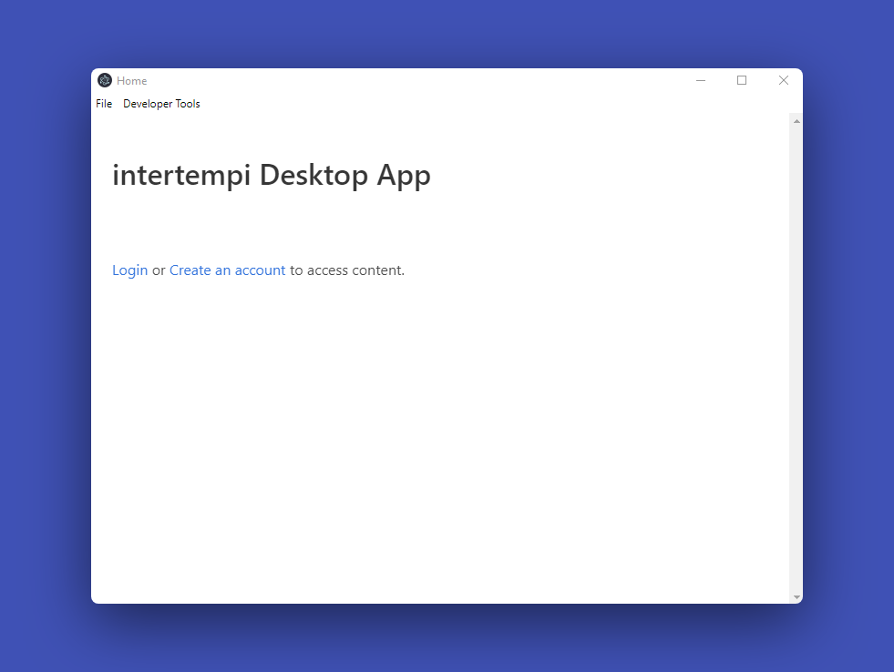
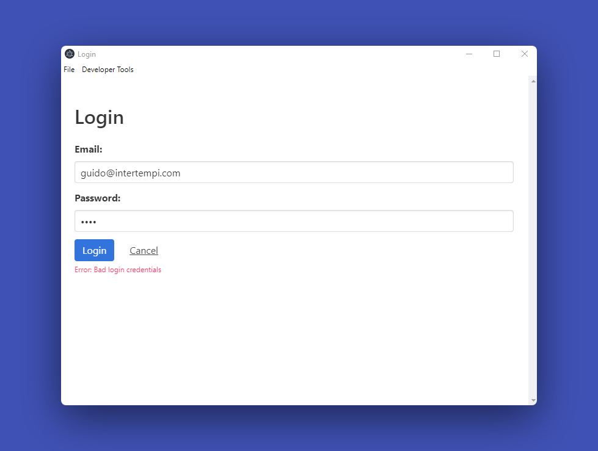

# intertempi Coding Challenge

### Requirements

- max 48 h to complete the challenge.
- No restriction of the knowledge sources.
- Use one of: vanilla JS, Typescript, ES6.
- start the project with `git init` as the starting point.
- commit and push all changes you will do into a separate github or gitlab repository of your choise and send the link after completing the task.

### Task Description

1. Build a simple **Electronjs-based desktop app** with two pages: Login and Home.
2. **Login** page should perform authentication of a user by email (by username) and password.
3. The minimalist version of **backend should allow a user to login or forbid** and show an error message if either the email or password is incorrect.
4. Any additional ideas are not required, but are welcomed.

---

### Implementation







### Quick Guide

1. Clone this repository

```sh
git clone https://github.com/guidosantillan01/intertempi-coding-challenge
```

2. Open a `mongod.exe` instance

3. Go into the BACKEND folder

```sh
cd intertempi-coding-challenge/backend
```

3. Install dependencies

```sh
npm install
```

4. Run the server, you will then be able to access it at `localhost:3000`

```sh
npm run server
```

5. Open another code editor instance
6. Go into the CLIENT folder

```sh
cd intertempi-coding-challenge/desktop-app
```

7. Install dependencies

```sh
npm install
```

8. Run the app. An Electron window will open.

```sh
npm start
```

---

### Packages Used:

- `bcrypt`
- `express`
- `jsonwebtoken`
- `electron`
- `env-cmd`
- `mongoose`
- `nodemon`
- `validator`

### Tools Used:

- `Postman`
- `Robo 3T`

### Things to improve in the future

- Password length validation
- Use of Mongo schema `.pre`, `.methods` and `.statics` to reduce controller's code.
- Use React to develop the Electron desktop app
- Implement testing
